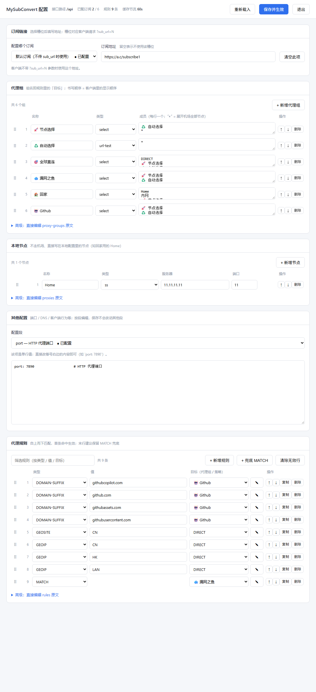

### 订阅转换服务（subconverter）

拉取机场 Clash 订阅，以**本地配置为唯一的配置来源**合并，返回最终 Clash 配置。

> 机场只贡献**代理节点**。除此之外的一切（代理组、规则、`dns`、端口、客户端行为……）
> **只使用本地配置**，机场的对应内容一律丢弃——不同机场的配置结构与规则集差异极大，
> 统一由本地决定后，换机场只影响节点列表，客户端里的行为完全不变。

## 请求处理流程

订阅在**后台线程**加载，请求优先吃缓存——机场慢或挂掉都不会拖住客户端。

| 步骤 | 条件 | 行为 |
| --- | --- | --- |
| ① 缓存命中 | 有缓存，且上次加载距今 < `cache_ttl`（默认 60 秒） | **直接返回缓存**，不等待、不请求机场 |
| ② 触发加载 | 无缓存，或上次加载已超过 `cache_ttl` | 触发一次**后台加载**，最多等 3 秒；等到新内容就返回新的，超时则返回旧缓存 |
| ③ 生成最小配置 | 无缓存，且订阅地址未配置 / 加载始终无果 | 根据本地配置生成最小配置文件（仅本地节点 + 本地代理组 / 规则） |
| ④ 转换 | 总是执行 | 除代理节点外全部取本地配置；把机场节点插入 `"*"` 表达式位置 |

> ①②③ 的产物都是第 ④ 步的输入，第 ④ 步始终执行，保证任一分支下输出都是完整可用的 Clash 配置。

### 加载与缓存的关键性质

- **同一订阅同时只允许一个加载线程**：已经在加载时再次触发会被忽略（日志 `正在加载中，本次不重复触发`），不会堆积请求。
- **缓存成功写入后永不过期**：即使机场长期故障，客户端也始终能拿到最后一次成功的节点列表。`cache_ttl` 只决定「多久去机场取一次」，不再决定「过期就丢弃」。
- **缓存落盘**：成功的缓存会写入 `sub_cache.json`，进程重启后首个请求即可直接命中，不必等首次拉取。
- **加载失败不改动缓存**：失败时保留原内容，下次请求超过 `cache_ttl` 后会自动重试。
- **等待上限 3 秒**：请求绝不会被慢机场长时间挂住——最多等 3 秒，随后返回手上已有的内容。

日志会明确写出走了哪条路径：`缓存命中：订阅 …（距今 N 秒 < M 秒），直接返回` / `触发后台加载订阅` /
`订阅 … 加载完成，等待 X.XX 秒` / `等待订阅 … 加载超过 3 秒（已等 3.0 秒），先返回现有内容`。

## 网页配置界面

浏览器打开 **`http://<本机>:5000/ui`**，先登录，再在线编辑 `config.yaml`。界面按用途分成若干块卡片：

- 常用项在上：**订阅链接 / 代理组 / 代理规则**；
- 不常用的**本地节点**与**其他配置**收在页面**最底部，默认折叠**，点标题行展开；
- 改访问密码点**右上角「访问密码」按钮**，在弹出的窗口里完成（不再占一整块卡片）。



### 0. 登录

- **必须登录**（界面可能暴露到公网，能打开 `/ui` 的人就能改配置）。
- 登录表单有**用户名**和**密码**两个框：**用户名任意填写、不做任何校验**，
  只是为了满足浏览器的「保存密码」识别条件（没有用户名框时 Chrome/Edge 不会弹出保存提示）。
- 密码与订阅接口的 `?password=` 是同一个，不用另外记。
- 登录成功后发放一个 **HMAC 签名的 cookie**（有效期 7 天，`httponly`），此后不再反复输密码。
- **重启进程会让所有已登录会话失效**（签名密钥是进程启动时随机生成的），需要重新登录。
- 顶栏「退出」清除 cookie。
- **默认安装没有密码**（`password_hash` 为空）。此时 `/ui` 可以直接打开，页面顶部会有
  醒目横幅催一句，订阅接口则**一律拒绝**——先把密码设上再谈别的。
- 改密码**立即生效**（配置热重载），旧密码当场失效。

### 1. 订阅链接

- 顶部**下拉列表**选择要配置哪个订阅槽位（默认订阅 / 订阅 1~5），选完在右侧填地址。
- 下拉项带 `● 已配置` / `○ 未配置` 标记，一眼看出哪些槽位空着。
- 「清空此项」把当前槽位置空（留空则该槽位回退到默认订阅）。
- 槽位与请求参数的对应关系：默认订阅 = 客户端不带 `?sub_url=N`；订阅 1~5 = `?sub_url=1` ~ `?sub_url=5`。
- 输入框里**只显示地址本身**，不显示 YAML 的引号——`sub_url: "https://a.c/x"` 显示为
  `https://a.c/x`，保存时按需重新加引号，语义不变。

### 2. 代理组

按 `proxy-groups` 逐组编辑，字段为**组名 / 类型 / 成员**：

| 列 | 说明 |
| --- | --- |
| 组名 | 规则里引用的名字；改名后规则目标下拉会自动跟着更新 |
| 类型 | `select` / `url-test` / `fallback` / `load-balance` / `relay` |
| 成员 | **每行一个**：组名 / 节点名 / `DIRECT` / `"*"`（展开为机场节点） |
| 操作 | ↑ ↓ 排序、复制、删除 |

> 组里没写的字段（`url` / `interval` / `tolerance` 等）**原样保留**，界面不显示的字段不会被删掉。

### 3. 本地节点（页面底部，默认折叠）

按 `proxies` 逐节点编辑，字段为**名称 / 类型 / 服务器 / 端口**：

| 列 | 说明 |
| --- | --- |
| 名称 | 节点名，代理组里按它引用 |
| 类型 | `ss` / `ssr` / `vmess` / `vless` / `trojan` / `hysteria2` / `tuic` 等 |
| 服务器 / 端口 | 地址与端口 |

> 节点的协议细节字段（`cipher` / `password` / `uuid` / `udp` / `sni` …）**界面不列出但一律原样保留**，
> 改完名称保存不会把协议参数弄丢。要改这些字段请用「高级：直接编辑 proxies 原文」。

### 4. 访问密码（右上角按钮 → 弹窗）

点右上角「访问密码」打开弹窗，里面是三个框：**当前密码 / 新密码 / 确认新密码**
（`Esc` 或点窗口外的暗色区域关闭）：

| 状态 | 界面表现 |
| --- | --- |
| 未设置密码 | 右上角按钮变橙、文案为「设置密码」，页顶有橙色提醒横幅；弹窗里「当前密码」框置灰，另有「清除密码」按钮隐藏 |
| 已设置密码 | 右上角按钮为「访问密码」，弹窗里三个框都可用，底部多出「清除密码」 |

- **只保存哈希**：服务端收到明文后立刻导出 PBKDF2 摘要再落盘，`config.yaml`、
  备份文件、日志里都不会出现明文；salt 每次随机，同一口令两次导出的哈希也不同。
- **不走「保存并生效」**：改密码是独立请求，不会混进被逐块回传的配置原文里。
- 新密码至少 **8 位**；两次输入不一致会被拦下。
- 改完**之前登录的会话全部失效**（cookie 签名里带着密码指纹），需要重新登录；当前页面会自动续上。
- 把「新密码」留空提交 = **清空密码**（回到默认状态，须二次确认）。
- 配置里就是这一行，看不到也推不出原来的密码：

```yaml
password_hash: "pbkdf2_sha256$200000$<随机salt>$<摘要>"
```

### 5. 其他配置（页面底部，默认折叠）

下拉选择要编辑的段，只列出**当前配置里确实存在**的顶层 key（端口、`mode`、`dns`、`tun` …），
在文本框里改原文。这样既覆盖了全部配置项，又不会推荐一堆空段。

### 6. 代理规则

规则以**结构化表格**编辑，每行一条，从上往下匹配：

| 列 | 说明 |
| --- | --- |
| 序号 / 拖拽手柄 | 拖 ⋮⋮ 或用 ↑ ↓ 调整顺序（顺序即优先级） |
| 类型 | 下拉选择（`DOMAIN-SUFFIX` / `IP-CIDR` / `MATCH` / `FINAL` 等）；`MATCH`/`FINAL` 自动隐藏「值」列 |
| 值 | 匹配内容，如 `github.com`、`192.168.80.0/24` |
| 目标 | 代理组名或策略，**下拉选择**（候选 = 本地已有代理组名 + 内置策略）；需要附加参数（如 `DIRECT,no-resolve`）时点 ✎ 切到手动输入 |
| 操作 | ↑ 上移、↓ 下移、复制、删除 |

- `+ 新增规则` 追加空行；`+ 兜底 MATCH` 一键补一条兜底规则；`清除无效行` 清掉填了一半的行。
- 顶部筛选框可按**类型 / 值 / 目标**过滤，规则多时方便定位。
- 展开「高级：直接编辑 rules 原文」可切到文本模式逐行编辑，两个按钮在**表格 ↔ 原文**之间同步。

> 规则类型/值/目标按 `TYPE,value,target` 三段解析；`no-resolve` 之类的附加参数会原样保留。
> 结构化编辑会剥掉规则行的行尾注释（注释归原文管），想保留注释请用「高级」里的原文模式。

### 通用行为

- 顶栏实时显示接口路径、已配置订阅数、规则条数、缓存节流间隔、配置文件时间。
- 点「保存并生效」后：先校验 YAML 合法性 → 备份原文件为 `config.yaml.bak` → 原子写入 → **内存热重载**。
  除 `api_path`（改路由需重启进程，界面会提示）外，其余配置**无需重启即刻生效**。
- 按**原始文本块**编辑，**注释、空行、键顺序都会保留**，不会被「整理」掉。
- 界面不显示的字段**一律原样写回**——代理组/节点上没列出来的协议参数、行尾注释都不会丢。
- 每次写回都会**真的解析一遍** YAML 做校验：列表段不是列表、缺 `name` 等会当场拒绝，
  并明确告知是哪一段、哪一条有问题；**校验失败不改动原文件**。

> 每次写回 YAML 标量（值带 `#`、`: `、首尾空格，或看起来像 `true`/`null` 时）会自动加引号，
> 其余（普通 URL、域名、带逗号或撇号的串）保持裸写，配置不会被无谓的引号污染。

## 核心特性

- `config.yaml` 既是服务配置文件，也是 Clash 配置本体。
- **除代理节点外只使用本地配置**：机场的 `proxy-groups` / `rules` / `dns` / 端口 / 客户端行为等一律不参与输出。换机场不会改变客户端的任何行为，只有节点列表变。
- 与 Clash 配置无关的控制项（密码、订阅链接等）在合并前自动剥离，不会泄漏到输出。
- **访问密码只存哈希**：PBKDF2-HMAC-SHA256 + 随机 salt（20 万次迭代，纯标准库实现，无新增依赖）；
  明文口令用完即弃，不进配置文件、备份与日志（日志里所有 `*password*` 字段统一抹成 `***`）。
  旧配置里的明文 `password` 首次加载会**自动升级**为哈希；默认值为空，在界面上随改随生效。
- 机场节点**按需后台加载**：命中新鲜缓存时零等待、零请求；需要更新时最多等 3 秒。
- Home 节点 IP/端口支持通过 `server_url` 动态刷新（持久化到 `home_cache.yaml`），每次请求都刷新，不参与上述缓存。

## 转换规则（本地配置为准）

| 内容 | 策略 |
| --- | --- |
| 顶层 key 与顺序 | **完全按本地配置**：机场的顶层 key 一个都不会进入输出 |
| `proxy-groups` | **只使用本地配置**，机场的代理组整体丢弃（同名组也不会被机场覆盖） |
| `rules` | **只使用本地配置**，机场的规则整体丢弃 |
| `proxies` | 本地节点 + 机场节点，按 `name` 去重，**本地同名优先**；机场节点插入 `"*"` 表达式所在位置，未使用表达式时追加到末尾 |

> 本地配置里没有的项，输出里也不会有（不会从机场「继承」）。原先依赖机场提供的 `dns`、
> `unified-delay` 等，现在需要在本文件里显式声明——`config.yaml` 已给出可直接用的写法。

### 表达式 `"*"`：插入机场节点

写在代理组的 `proxies` 列表（或顶层 `proxies` 列表）中，代表「此处插入机场带来的全部节点」：

```yaml
proxy-groups:
  - name: 🚀 节点选择
    type: select
    proxies:
      - ♻️ 自动选择
      - "*"                    # ← 展开为机场的全部节点
      - DIRECT
  - name: ♻️ 自动选择
    type: url-test
    url: http://www.gstatic.com/generate_204
    interval: 300
    proxies:
      - "*"                    # ← 同样展开为机场的全部节点
```

> ⚠️ YAML 中**必须加引号**写作 `- "*"`。裸写 `- *` 是 YAML 的别名（alias）语法，
> 解析会直接失败（日志报 `while scanning an alias`），此时接口返回 `Hello World!`。

行为说明：

- 展开的是**机场带来的节点**：与本地模板同名的节点不算（本地定义优先），因此不会重复插入；
- 表达式在输出前一定被展开，不会残留到最终配置里；
- 同一组内自动去重，保留成员首次出现的位置；
- **组内只有一个表达式且没有机场节点时**，该组会兜底为 `DIRECT`（Clash 要求代理组至少有一个成员），
  避免机场不可用时输出非法配置；
- 本地配置里**完全没有**这个表达式时，机场节点仍会进入顶层 `proxies`，
  但不会被任何代理组引用（日志会给出 `本地配置未使用 * 表达式` 警告）。

> 想从输出中临时去掉某个顶层 key，直接注释掉配置文件里对应的那段即可。
> 无机场节点（`sub_url` 为空，或拉取失败且缓存未命中）时，第 ③ 步生成的最小配置文件就是本地模板本身，
> 表达式展开为空、组内兜底 `DIRECT`，再经第 ④ 步输出。

> 输出前有两项自证日志（仅在异常时出现）：`规则的目标不存在`（规则指向未定义的组或节点）、
> `代理组成员不存在`（组里写了不存在的节点名，含旧版表达式 `__REMOTE_PROXIES__` 的残留）。

## 接口说明

### 1. 获取订阅

- 请求方式：`GET`
- 路径：`/api`（与 `config.yaml` 的 `api_path` 一致，修改需重启）
- 参数：
  - `password`：访问密码（必填，错误返回 `Hello World!`）。服务端用
    `config.yaml` 里的 **`password_hash`** 校验（PBKDF2-SHA256，20 万次迭代），
    配置里从来没有明文，日志里的这个值也会被抹成 `***`。
    **未设置密码时本接口一律拒绝**（先到 `/ui` 里设一个）。
  - `sub_url`：可选，选择用哪个订阅地址。规则见下方「多订阅地址」

#### 多订阅地址

`config.yaml` 中可配置 `sub_url`（默认）与 `sub_url1` ~ `sub_url5`（备用），通过请求参数选择：

| 请求 | 使用的地址 |
| --- | --- |
| 不传 `sub_url` | `sub_url` |
| `?sub_url=1` | `sub_url1` |
| `?sub_url=2` … `?sub_url=5` | `sub_url2` … `sub_url5` |
| `?sub_url=https://...` | 直接使用该地址（兼容旧用法） |
| `?sub_url=9`（超出 1~5） | 忽略，使用 `sub_url` |
| `?sub_url=N` 但 `sub_urlN` 为空 | 回退 `sub_url` |

各个地址**独立缓存**（缓存的 key 是最终解析出的完整地址），因此可以在客户端建多个订阅配置分别指向不同机场，互不影响。选择与回退过程会打印 `按请求选择订阅地址` / `sub_urlN 未配置，回退默认 sub_url` 等日志。

成功返回 `text/plain` 的 Clash 配置；若机场返回 `subscription-userinfo`，会原样透传该响应头。

> 该响应头来自当次实时拉取，因此总是最新的。仅当拉取失败并回退缓存时，它才是缓存时的旧值；完全没有可用数据时不带该响应头，客户端会保留上次的显示值。

### 2. 网页配置界面

界面已暴露到公网，因此**所有接口都需要登录**（密码即上面那个 `password`）。
唯一例外是**尚未设置密码**时：`/ui` 与 `/ui/password` 放行，让你先把密码设上。

| 请求 | 说明 |
| --- | --- |
| `GET /ui/login` | 登录页（已登录则跳转 `/ui`；没设密码时直接跳转 `/ui`） |
| `POST /ui/login` | 表单 `username=...&password=...`（`username` 不校验，可省略），成功后种 cookie 并跳回 `next`（仅允许站内路径） |
| `GET /ui/logout` | 清除 cookie 并跳回登录页 |
| `GET /ui` | 配置编辑页面（未登录 302 到登录页） |
| `POST /ui/save` | 保存配置并热重载（未登录返回 401 JSON） |
| `POST /ui/password` | 修改访问密码，见下方「修改密码」 |

#### 修改密码

`POST /ui/password`，body 为 JSON：

```json
{ "old_password": "旧密码", "new_password": "新密码" }
```

| 情况 | 响应 |
| --- | --- |
| 已设密码且 `old_password` 正确 | `{"ok": true}`；写回哈希前会先解析一遍 YAML 做校验，校验失败不动原文件 |
| `old_password` 错误 | `403 {"ok": false, "error": "原密码不正确"}` |
| 新密码不足 8 位 | `{"ok": false, "error": "密码至少 8 位"}` |
| `new_password` 为空 | 清空密码（回到未设置状态），响应 `{"ok": true, "cleared": true}` |

成功后会**重新下发 cookie**：cookie 签名里含密码指纹，改密码等于把所有旧会话踢下线。

`POST /ui/save` 的 body 为 `{"blocks": {"字段名": "内容"}}`。可写字段：

- 订阅槽位 `sub_url` ~ `sub_url5`：值为地址字符串；
- 列表段 `proxies` / `proxy-groups`：值为**完整 YAML 段文本**（自带 `proxies:` 首行）；
- 多行段 `rules`：值为**完整 YAML 段文本**（自带 `rules:` 首行）；
- 其他顶层段（`dns` / `tun` / `mode` …）：值为该段的原文。

未包含在 `blocks` 里的段一律原样保留；每次保存都会先校验 YAML（列表段必须是列表、每项要有 `name`），
失败则返回具体原因且**不写文件**。

### 3. 健康检查

- `GET /health` → `ok`

## 配置项（config.yaml）

控制项（不会出现在输出中）：

| 配置项 | 说明 |
| --- | --- |
| `api_path` | 订阅接口路径，默认 `/api` |
| `password_hash` | 接口访问密码的 **PBKDF2-SHA256 哈希**，默认空（未设置密码）；在 `/ui` 的「访问密码」里设置 / 修改 / 清空。**不要手工填明文**（旧配置里的明文 `password` 会在首次加载时自动升级成这一项） |
| `password` | 已废弃的明文写法（仅兼容读取，加载后会被改写成 `password_hash`） |
| `sub_url` | 默认机场订阅链接，可为空 |
| `sub_url1` ~ `sub_url5` | 备用订阅链接，客户端请求 `?sub_url=N` 时使用；为空则回退 `sub_url`（详见「多订阅地址」） |
| `basic_auth` | 动态刷新 Home IP 的基础认证 `username:password`（可选） |
| `server_url` | 获取 Home 节点最新 IP/端口 的服务地址（可选，为空则不刷新） |
| `cache_ttl` | **缓存重新加载间隔**（秒，默认 60）：上次加载距今小于该值就直接用缓存，超过则触发重新加载。缓存本身成功写入后**永不过期**（并落盘 `sub_cache.json`）。请求触发加载后最多等 3 秒 |

> `remove_keys` / `exclude_groups` / `merge_groups` 已**废弃**：输出的顶层 key、代理组与规则现在全部只取本地配置，
> 无需再移除或排除任何内容（想临时去掉某个 key，直接注释掉配置文件里对应的那段）。
> 配置里若还留着这几项，不会生效（但会被当作控制项剥离，不会泄漏到输出配置中），可自行删除。

其下为 Clash 配置本体（顶层 key、`proxies`、`proxy-groups`、`rules`）。除代理节点外，
输出内容全部取自这里，所以要改客户端行为直接改本文件即可。

## 配置文件示例（config.yaml）

> ⚠️ 以下示例中的 IP、密码、域名均为**占位符**，请替换为你的真实值。
> `config.yaml` 包含真实订阅地址与密码等敏感信息，**切勿提交到公开仓库**。

```yaml
# ===================== 服务控制配置 =====================
api_path: /api            # 订阅接口路径（修改需重启进程）
password_hash: ""         # 访问密码的哈希（**不填明文**）；默认空 = 未设置密码，
                          # 此时订阅接口一律拒绝；到 /ui 的「访问密码」里设置即可
sub_url: ""               # 默认机场订阅链接，可为空；为空时根据下方本地配置生成最小配置文件
sub_url1: ""              # 备用订阅 1：客户端请求 ?sub_url=1 时使用（为空则回退 sub_url）
sub_url2: ""              # 备用订阅 2：?sub_url=2
sub_url3: ""              # 备用订阅 3：?sub_url=3
sub_url4: ""              # 备用订阅 4：?sub_url=4
sub_url5: ""              # 备用订阅 5：?sub_url=5
basic_auth: ""            # 动态刷新 Home 节点 IP/端口 的基础认证 username:password（可选）
server_url: ""            # 获取 Home 节点最新 IP/端口 的服务地址（可选，为空则不刷新）
cache_ttl: 60           # 缓存重新加载间隔（秒）：超过该值才去机场重新拉取；缓存本身永不过期

# ===================== Clash 配置模板 =====================
dns:
  enable: true
  enhanced-mode: fake-ip           # fake-ip 分流更准；需要真实解析可改 redir-host
  fake-ip-range: 198.18.0.1/16
  fake-ip-filter:                  # 命中这些域名时返回真实 IP
    - '*.lan'
    - '*.local'
    - '*.arpa'
    - '+.stun.*'
    - localhost.ptlogin2.qq.com
    # - nas.example.com            # 让 NAS 域名走真实解析（需本地 DNS 能解析它）
  nameserver:
    - 119.29.29.29
    - 223.5.5.5
  nameserver-policy:
    "nas.example.com": "192.168.80.1"   # 改为你路由器的局域网 IP

port: 7890              # HTTP 代理端口
socks-port: 7891        # SOCKS5 代理端口
allow-lan: true         # 是否允许局域网访问
mode: Rule              # 运行模式：Rule(规则) / Global(全局) / Direct(直连)
log-level: info
external-controller: 127.0.0.1:9090

# 客户端行为（原先继承自机场，现改为本地声明；不需要就整行删掉）
ipv6: false
unified-delay: true
keep-alive-interval: 360
global-client-fingerprint: chrome

# 代理节点配置（机场节点会自动补充进来，无需在此列出）
proxies:
  - name: Home
    type: ss
    server: 11.11.11.11    # 改为你的 Home 节点地址
    port: 11
    cipher: aes-256-gcm
    password: change-me
    udp: true

# 代理组配置（只使用本文件中的配置，机场的代理组一律丢弃）
proxy-groups:
  - name: 🏠 Nas           # 自定义组：回家走 Home 节点
    type: select
    proxies:
      - Home
      - DIRECT
  - name: 🚀 节点选择       # 主选择组：手动挑选机场节点
    type: select
    proxies:
      - ♻️ 自动选择
      - "*"                # 展开为机场的全部节点
      - DIRECT
  - name: ♻️ 自动选择       # 自动测速：延迟最低的机场节点
    type: url-test
    url: http://www.gstatic.com/generate_204
    interval: 300
    proxies:
      - "*"                # 展开为机场的全部节点
  - name: 🐟 漏网之鱼       # 未匹配任何规则的流量
    type: select
    proxies:
      - 🚀 节点选择
      - DIRECT

# 规则配置（只使用本文件中的配置，机场的规则一律丢弃）
rules:
  - IP-CIDR,192.168.80.0/24,🏠 Nas   # 改为你的局域网网段
  - DOMAIN-SUFFIX,nas.example.com,🏠 Nas
  - MATCH,🐟 漏网之鱼
```

## 运行

### Docker（推荐：外部挂载 config.yaml）

构建镜像：

```bash
docker build -t mysubconvert .
```

运行（将宿主机上的 `config.yaml` 挂载进容器，改配置无需重新构建镜像）：

```bash
docker run -d --name mysubconvert \
  -p 5000:5000 \
  -v /path/to/config.yaml:/app/config.yaml \
  mysubconvert
```

或使用 docker-compose（`docker-compose.yml`）：

```yaml
services:
  mysubconvert:
    image: ghcr.io/sjj-dot/mysubconvert:latest   # 或本地构建的 mysubconvert
    container_name: mysubconvert
    restart: unless-stopped
    ports:
      - "5000:5000"
    volumes:
      - ./config.yaml:/app/config.yaml          # 外部配置，改配置无需重建镜像
```

> 宿主机修改 `config.yaml` 后，执行 `docker restart mysubconvert` 生效（`api_path` 修改需重启进程）；
> 在网页界面里改则是即时热重载，无需重启。

#### 为什么「手动改能行，界面保存却报错」

单文件 bind mount（`-v ./config.yaml:/app/config.yaml`）下，**往挂载点上 rename 会被内核拒绝**：

```
写入失败：[Errno 16] Device or resource busy: '/app/config.yaml.tmp' -> '/app/config.yaml'
```

这是 bind mount 的固有行为，与权限无关——容器里手动执行同样的 `mv config.yaml.tmp config.yaml`
也会报这个错；而下载到宿主机上编辑再上传，操作的是宿主机那一侧的文件，不受影响。

程序的应对（`replace_file`）：先尝试 `tmp → replace` 原子替换，被文件系统拒绝时自动降级为
**打开原文件原地覆盖写**（写前已备份 `config.yaml.bak`），所以界面保存能正常写入；只有真正
只读挂载时才报错。原子替换失败会在日志里留一条 warning，属正常提示，不影响使用。

### 本地

```bash
pip install -r requirements.txt
python main.py   # 监听 0.0.0.0:5000
```

## 发布（打 tag 自动构建镜像）

push 代码后打版本 tag，触发 GitHub Actions 自动构建并推送 `latest` 与版本号两个镜像标签：

```bash
git add . && git commit -m "v1.0.0"
git push
git tag v1.0.0 && git push origin v1.0.0
```

服务器更新：

```bash
docker pull ghcr.io/sjj-dot/mysubconvert:latest
docker compose up -d --force-recreate   # 或：docker rm -f mysubconvert && docker run ...（同上）
```

## 测试

```bash
pip install pytest
pytest tests/test_convert.py -q
```
